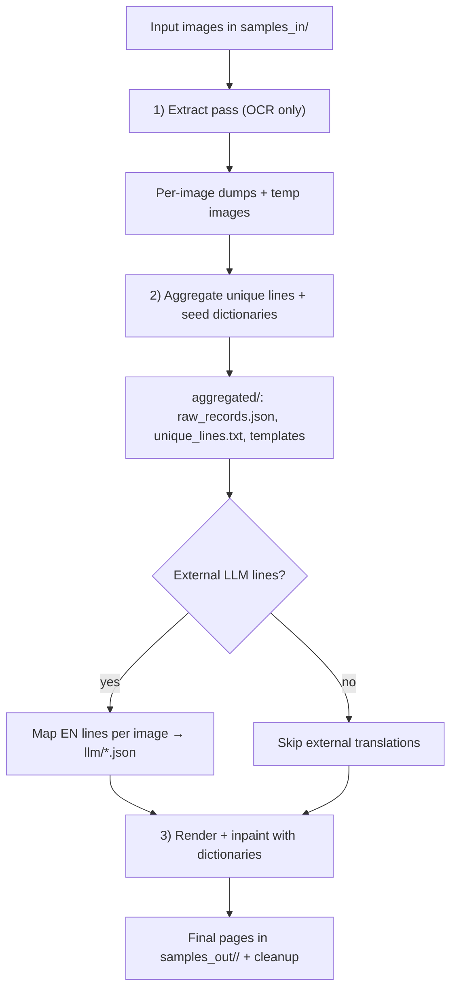
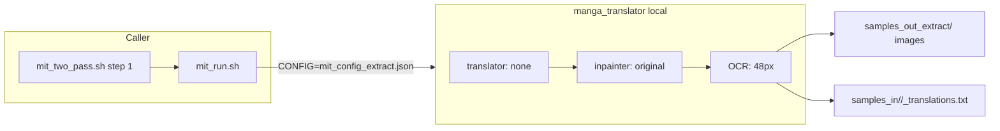
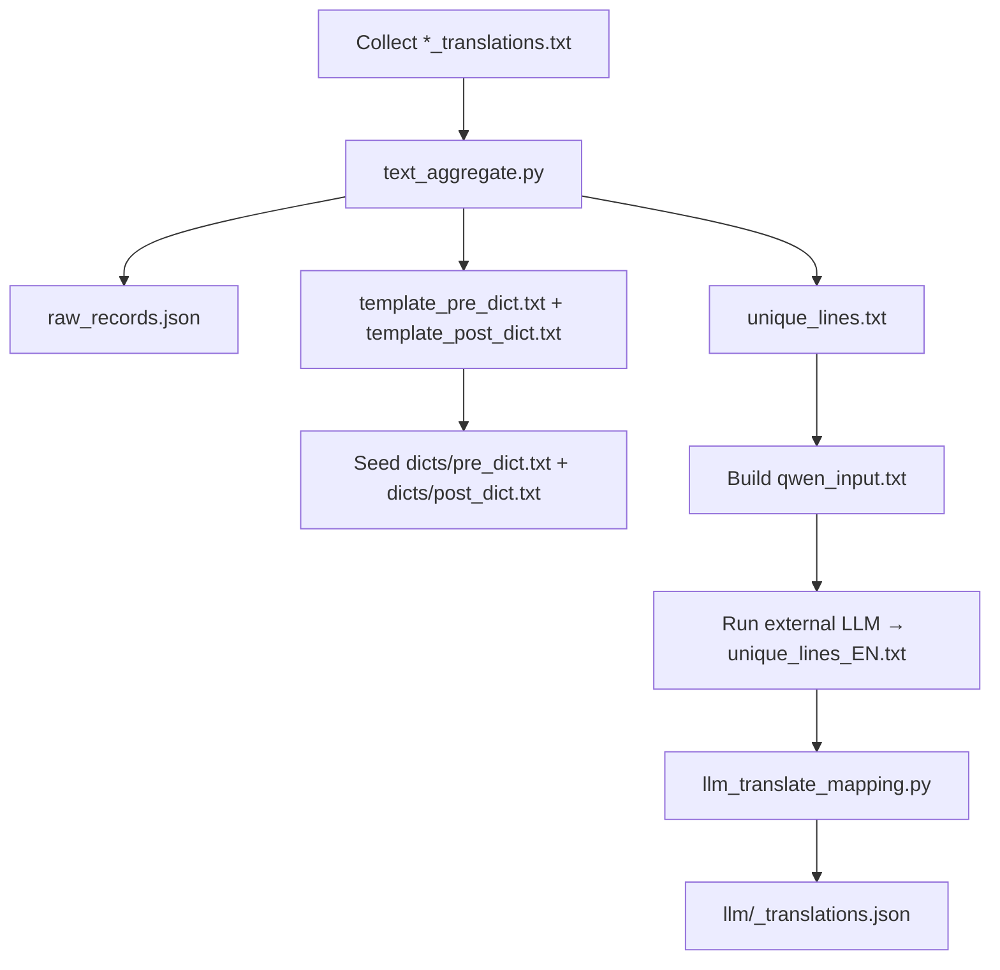
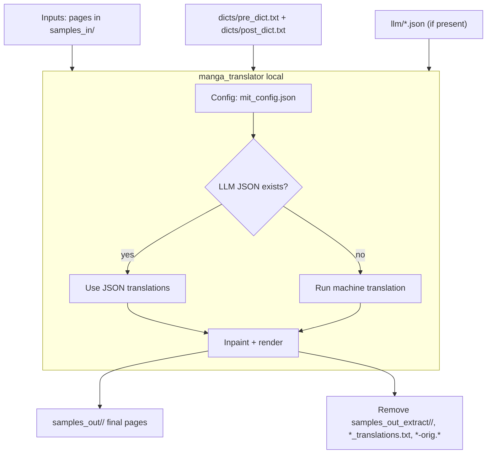

# Manga Translate (macOS, Apple Silicon) 🖼️➡️🗣️

This repository glues together a **fast, local, no‑API manga pipeline** on macOS (M1/M2/M3).  
It wraps the upstream [manga-image-translator](https://github.com/zyddnys/manga-image-translator) with Mac‑tuned scripts, a Webtoon grabber, and a **two‑pass workflow** for consistent translations.

> ⚠️ This repo does **not vendor upstream code**. It fetches the original project during bootstrap.  
> Full credit to upstream authors: [zyddnys/manga-image-translator](https://github.com/zyddnys/manga-image-translator).

---

## ✨ Features
- **Optimized for macOS + Apple Silicon (MPS)**  
- One‑shot bootstrap (virtualenv, deps, models)  
- Webtoon downloader (Naver supported)  
- **Two‑pass translation pipeline** for consistency across chapters  
- Dictionary support for pre/post translation normalization  
- Optional integration with **external LLM translators** (Qwen, Gemini)  
- Golden override patches via `scripts/patched_files/`  

---

## 📂 Repository Layout
```
.
├── scripts/
│   ├── bootstrap_and_run.sh      # Bootstrap venv + clone MIT + quick test
│   ├── mit_run.sh                # Run single-pass translation
│   ├── mit_two_pass.sh           # Recommended: two-pass pipeline
│   ├── mit_mac.env               # Environment defaults
│   ├── mit_config.json           # Fast config (CPU translation + GPU vision)
│   ├── mit_config_extract.json   # Extract-only config (OCR only)
│   ├── grab_webtoon.py           # Webtoon downloader (CLI/GUI)
│   ├── text_aggregate.py         # Aggregate OCR lines + seed dictionaries
│   ├── llm_translate_mapping.py  # Map EN lines back to per-image arrays
│   ├── get_nllb_small.sh         # Optional: NLLB CT2 model converter
│   └── patched_files/            # Golden overrides applied into upstream
├── samples_in/
├── samples_out/
├── aggregated/<chapter>/
├── dicts/
└── third_party/manga-image-translator/
```

---

## 🚀 Quick Start

```bash
# 0) Install requirements
xcode-select --install
brew install python@3.11 cmake pkg-config

# 1) Bootstrap (first time only)
bash scripts/bootstrap_and_run.sh

# 2) Grab a Webtoon chapter
. .venv/bin/activate
python scripts/grab_webtoon.py --url "https://m.comic.naver.com/webtoon/detail?titleId=<ID>&no=<NO>"

# 3) Run translation (two-pass recommended)
bash scripts/mit_two_pass.sh --input samples_in/<chapter_folder>
```

---

## ⚙️ Requirements
- macOS on **Apple Silicon (M1/M2/M3)**
- Python 3.11 recommended (`brew install python@3.11`)
- Xcode Command Line Tools
- Optional: `cmake`, `pkg-config`

Check GPU (MPS) availability after bootstrap:

```bash
. .venv/bin/activate
python3 -c "import torch; print(torch.__version__, torch.backends.mps.is_available())"
```

Expected output: `2.8.0 True`

---

## 🔧 Bootstrap Details
- Pins Python to **3.10/3.11** (exits on 3.12/3.13 due to missing wheels).  
- Clones upstream MIT into `third_party/` if missing.  
- Option: pin to a specific commit/tag:  
  ```bash
  MIT_COMMIT=<ref> bash scripts/bootstrap_and_run.sh
  ```
- Installs deps, CTranslate2, and downloads the small NLLB CT2 model.  
- Runs a small sanity batch via `mit_run.sh`.  
- Installs golden overrides from `scripts/patched_files/` into upstream (`.orig` backups created).  

---

## 🧩 Run Modes

### Single‑Pass (quick test)
```bash
bash scripts/mit_run.sh --use-gpu-limited --overwrite -v
```

### Two‑Pass (recommended)
```bash
bash scripts/mit_two_pass.sh --input samples_in/<chapter_folder>
```

**Why two‑pass?**  
1. Extract OCR → aggregate unique lines  
2. Build/edit dictionaries (`dicts/pre_dict.txt`, `dicts/post_dict.txt`)  
3. Translate + render final pages  

> Two‑pass ensures consistent translation of names and phrases across pages.

---

## 🔄 Two‑Pass Workflow

### Macro Pipeline


### Step 1: Extract Pass


### Step 2: Aggregate + Dictionaries


### Step 3: Render + Inpainting


---

## 📖 Dictionaries

- **`dicts/pre_dict.txt`** — normalize OCR quirks, romanize names, fix spacing  
- **`dicts/post_dict.txt`** — enforce English phrasing/terminology  

Example entries:
```
뉴스테이블\s* News Table
수혁이 Su-hyeok
A\.I\. AI
```

---

## 🧠 External LLM Translation (Optional)
Between steps 2 & 3 you can call an external CLI (Qwen, Gemini).  

```bash
cat "aggregated/<chapter>/qwen_input.txt" | qwen  > "aggregated/<chapter>/unique_lines_EN.txt"

# OR if you want to define the qwen model

cat "aggregated/<chapter>/qwen_input.txt" | qwen -m qwen-7b > "aggregated/<chapter>/unique_lines_EN.txt"
```

The script resumes once `unique_lines_EN.txt` exists. It then maps lines back per image:  

```bash
scripts/llm_translate_mapping.py
# → aggregated/<chapter>/llm/<image>_translations.json
```

Then render normally:  
```bash
bash scripts/mit_two_pass.sh --input samples_in/<chapter_folder>
```

**Advanced flags:**  
- `QWEN_BIN` (default `qwen`)  
- `QWEN_MODEL` — specify model  
- `FORCE_QWEN=1` — force prompt even if EN already exists  

---

## 🛠️ Troubleshooting

- **Python build errors** (`pydensecrf`, `pydantic-core`): use Python 3.10/3.11  
- **Torch MPS not found**: ensure bootstrap installed PyTorch with MPS  
- **No module named manga_translator**: run via `scripts/mit_run.sh`  
- **Tokenizers fork warning**: suppress with `TOKENIZERS_PARALLELISM=false`  
- **Outputs not overwritten**: add `--overwrite` or `EXTRA_FLAGS="--overwrite"`  
- **Temporary caches**: stored under `.cache/filtered/*` and `.cache/filtered_render/*`, auto‑cleaned after runs  
- **Final output hygiene**: two‑pass removes `samples_out_extract/`, `*_translations.txt`, and `*-orig.*` helpers  

---

## 📌 Handy Commands
```bash
# Verify GPU (MPS)
python -c "import torch; print(torch.__version__, torch.backends.mps.is_available())"

# Single-pass quick run
bash scripts/mit_run.sh --use-gpu-limited --overwrite -v

# Two-pass on all chapters
for d in samples_in/naver_*; do bash scripts/mit_two_pass.sh --input "$d"; done
```

---

## 📜 Credits
- Upstream project: [manga-image-translator](https://github.com/zyddnys/manga-image-translator)  
- This repo only provides a **macOS wrapper** and does not vendor upstream code.  
