# Manga Translate (macOS, Apple Silicon) 🖼️➡️🗣️

This repo glues together a fast, local, no‑API manga pipeline on macOS (M1/M2/M3). It wraps the upstream "manga-image-translator" with Mac‑tuned scripts, a webtoon grabber, and a two‑pass workflow for better translation consistency.

This repository provides a macOS‑optimized wrapper over the upstream “manga-image-translator”. It does not vendor upstream code; instead it fetches the original project during bootstrap. Full credit to the upstream authors: https://github.com/zyddnys/manga-image-translator

## Contents

- Scripts
  - `scripts/bootstrap_and_run.sh` — one‑shot bootstrap (venv, clone MIT, deps, model) + quick test
  - `scripts/mit_run.sh` — run the translator (single pass)
  - `scripts/mit_two_pass.sh` — extract → aggregate → translate (two‑pass)
  - `scripts/grab_webtoon.py` — download Naver Webtoon chapter images
  - `scripts/text_aggregate.py` — build unique‑text lists + dictionary templates
  - `scripts/get_nllb_small.sh` — optional NLLB CT2 model converter
- Configs
  - `scripts/mit_mac.env` — defaults (paths, flags). You can override at call time.
  - `scripts/mit_config.json` — fast MPS config (CPU translation via CT2 + GPU vision)
  - `scripts/mit_config_extract.json` — extract‑only config (no MT, no heavy inpainting)

## 0) Requirements

- macOS on Apple Silicon (M1/M2/M3)
- Xcode CLT: `xcode-select --install`
- Python 3.11 (recommended): `brew install python@3.11`
- Optional Homebrew deps: `brew install cmake pkg-config`

Check MPS (Apple GPU) availability:

```
. .venv/bin/activate 2>/dev/null || true
python - <<'PY'
import torch; print(torch.__version__, torch.backends.mps.is_available())
PY
```

Expect something like: `2.8.0 True`.

## 1) Bootstrap (one‑time)

From the repo root:

```
bash scripts/bootstrap_and_run.sh
```

If your Python 3.11 is not on PATH, pass it explicitly:

```
PYTHON_BIN=python3.11 bash scripts/bootstrap_and_run.sh
```

## 2) Grab From URL → Choose Run Mode

Interactive CLI:

```
. .venv/bin/activate
python scripts/grab_webtoon.py --url "https://m.comic.naver.com/webtoon/detail?titleId=<ID>&no=<NO>"
```

Notes:
- Desktop URLs are auto‑rewritten to mobile for reliable image access (e.g., comic.naver.com → m.comic.naver.com).
- Creates a per‑chapter folder under `samples_in/`, e.g. `samples_in/naver_<ID>_<NO>_<slug>/`
- Writes a manifest at `aggregated/<chapter>/.chapter.json`
- Offers an interactive menu: [1] two‑pass, [2] single‑pass, [3] skip (opens folder)

Alternatively, prompt for the URL interactively:

```
. .venv/bin/activate
python scripts/grab_webtoon.py
```

Explanation:
- The script asks you to paste a Webtoon URL, then applies the same normalization (desktop → mobile), parsing, and download steps.
- Destination is still automatically derived and created under `samples_in/<label>`; the same next‑step menu appears when downloads complete.

GUI mode (optional):

```
python scripts/grab_webtoon.py --gui
```

Notes about the GUI:
- Opens a small Tkinter window (real GUI) to paste a URL and pick an output folder.
- Downloads images in order to the chosen folder. It does not create the per‑chapter label folder or write the `.chapter.json` manifest.
- It also does not show the post‑download run menu. Use the CLI mode above for the full automated flow.

## 3) Run Single‑Pass (optional quick run)

Runs detection/OCR/inpainting on GPU (MPS), translation on CPU via CT2 (`m2m100`).

```
bash scripts/mit_run.sh --use-gpu-limited --overwrite -v
```

You can override defaults at call time, e.g.:

```
INPUT_DIR=./samples_in/<chapter_folder> \
OUTPUT_DIR=./samples_out/<chapter_folder> \
FONT_PATH="/System/Library/Fonts/Supplemental/Arial Unicode.ttf" \
bash scripts/mit_run.sh --use-gpu-limited --overwrite -v
```

## 4) Run Two‑Pass (recommended for consistency)

The pipeline extracts text across pages first, then aggregates unique lines so you can build dictionaries that enforce consistent names/phrases before rendering.

Run all steps for a grabbed chapter (auto‑detects chapter from `.chapter.json`):

```
bash scripts/mit_two_pass.sh --input samples_in/<chapter_folder>
```

What it does:
1. Extract pass (no MT, no heavy inpainting)
   - Config: `scripts/mit_config_extract.json`
   - Writes per‑image text dumps next to inputs (used for aggregation)
   - Aggregates into: `aggregated/<chapter>/{raw_records.json, unique_lines.txt}`
   - Temporary images: `samples_out_extract/<chapter>/` (auto‑deleted after step 3)
2. Aggregate unique lines and seed dictionaries
   - Writes `aggregated/<chapter>/{raw_records.json, unique_lines.txt, template_pre_dict.txt, template_post_dict.txt}`
   - Seeds `dicts/pre_dict.txt` and `dicts/post_dict.txt` if missing
3. Translate + render with dictionaries
   - Config: `scripts/mit_config.json`
   - Output: `samples_out/<chapter>/` (final translated images)

Edit dictionaries for coherence:

- `dicts/pre_dict.txt` (BEFORE translation): normalize OCR quirks, romanize names, set terms
  - Examples: `뉴스테이블\s* News Table` · `수혁이 Su-hyeok` · `A\.I\. AI`
- `dicts/post_dict.txt` (AFTER translation): enforce English phrasing
  - Examples: `National broadcaster KBS` · `medical institution hospital`

Render‑only after editing dicts:

```
bash scripts/mit_two_pass.sh --input samples_in/naver_... --render-only
```

Extract‑only (prepare text/dicts; skip rendering):

```
bash scripts/mit_two_pass.sh --input samples_in/naver_... --extract-only
```

Debug a small slice (limit pages processed):

```
bash scripts/mit_two_pass.sh --input samples_in/<chapter_folder> --extract-only --limit 20
# When happy, render the same slice
bash scripts/mit_two_pass.sh --input samples_in/<chapter_folder> --render-only --limit 20
# Finally, run the full chapter without --limit
bash scripts/mit_two_pass.sh --input samples_in/<chapter_folder>
```

## Two‑Pass Diagrams

Macro overview of the full pipeline, followed by micro diagrams for each step.

```mermaid
graph TD
    A["Input images in samples_in/&lt;chapter&gt;"] --> B["1) Extract pass<br/>(OCR only)"]
    B --> C["Per-image dumps: &lt;stem&gt;_translations.txt<br/>+ temp images in samples_out_extract/&lt;chapter&gt;/"]
    C --> D["2) Aggregate unique lines<br/>+ seed dictionary templates"]
    D --> E["aggregated/&lt;chapter&gt;:<br/>raw_records.json, unique_lines.txt,<br/>template_*_dict.txt"]
    E --> F{"External LLM lines?<br/>(unique_lines_EN.txt)"}
    F -- yes --> G["Map EN back per image<br/>llm_translate_mapping.py →<br/>aggregated/&lt;chapter&gt;/llm/*.json"]
    F -- no --> H["Skip external translations"]
    G --> I["3) Render + inpaint with dictionaries<br/>and optional LLM per-image arrays"]
    H --> I
    I --> J["Final pages in samples_out/&lt;chapter&gt;/<br/>Cleanup: remove samples_out_extract/&lt;chapter&gt;/"]
```



### Micro: 1) Extract Pass (OCR‑only)


**Details:**

- Each `*_translations.txt` is written next to its source image and preserves region order for later mapping.
- These files are the "link" that ties OCR'd regions back to the specific page.

### Micro: 2) Aggregate + Optional LLM


**Notes:**

- Aggregation keeps literal line identity; LLM output must match line counts (mapper pads/truncates with warnings if needed).
- Per‑image JSON arrays align 1:1 to the detected regions for each page.

### Micro: 3) Render + Dictionaries (+ LLM overrides)


## 5) Configuration

- `scripts/mit_config.json` (fast defaults)
  - Translator: `m2m100` (CTranslate2 on CPU)
  - Detector: `ctd`, `detection_size: 1280`
  - Inpainter: `inpainting_size: 1024`, `inpainting_precision: fp16`
  - OCR: `48px`
  - Render: `manga2eng_pillow`, centered, horizontal, no hyphenation, font sizing tweaks
- `scripts/mit_config_extract.json` (extract‑only)
  - Translator: `none`
  - Inpainter: `original` (skip heavy inpainting)
- `scripts/mit_mac.env`
  - `INPUT_DIR`, `OUTPUT_DIR`, MPS/env defaults; optional `FONT_PATH`

## 6) GPU vs CPU on Mac

- GPU (MPS): used for detection, OCR, inpainting — biggest speedups
- Translation: stays on CPU via CTranslate2 (fast on M‑series using Accelerate)
- Use `--use-gpu-limited` to enable GPU for vision steps

## 7) Troubleshooting

- Python 3.12/3.13 build errors (`pydensecrf`, `pydantic-core`): use Python 3.10/3.11
- `No module named manga_translator`: use `scripts/mit_run.sh` so `PYTHONPATH` is set
- Tokenizers "fork" warning: silenced by `TOKENIZERS_PARALLELISM=false`
- Not overwriting outputs: add `--overwrite` or `EXTRA_FLAGS="--overwrite"`
- Placeholders in `samples_out/`: two‑pass now writes extract images to `samples_out_extract/<chapter>/` and removes them after rendering

## 8) Handy Commands

- Verify MPS: `python -c "import torch; print(torch.__version__, torch.backends.mps.is_available())"`
- Single pass: `bash scripts/mit_run.sh --use-gpu-limited --overwrite -v`
- Two‑pass for a folder: `bash scripts/mit_two_pass.sh --input samples_in/<chapter_folder>`
- Batch many chapters: `for d in samples_in/naver_*; do bash scripts/mit_two_pass.sh --input "$d"; done`

## 9) Layout

```
.
├── scripts/
│   ├── bootstrap_and_run.sh
│   ├── mit_run.sh
│   ├── mit_two_pass.sh
│   ├── mit_mac.env
│   ├── mit_config.json
│   ├── mit_config_extract.json
│   ├── grab_webtoon.py
│   ├── text_aggregate.py
│   └── get_nllb_small.sh
├── samples_in/
├── samples_out/
├── aggregated/<chapter>/
├── dicts/
└── third_party/manga-image-translator/
```

## 11) Optional: External LLM Translator (Qwen/Gemini) via CLI

If you prefer using an external LLM CLI (e.g., Qwen CLI or Gemini CLI) to translate text lines, you can slot it between Steps 2 and 3. This can yield higher translation quality while keeping OCR/inpainting/typesetting local.

Current phase (wired and working):

1) Extract + aggregate
   - Produces:
     - `aggregated/<chapter>/unique_lines.txt` (freq + source text)
     - `aggregated/<chapter>/raw_records.json` (per‑image OCR structure)

2) Translate via Qwen CLI (manual, one shot)
   - The two‑pass script builds a strict prompt at `aggregated/<chapter>/qwen_input.txt`, then waits.
   - Recommended (set `QWEN_MODEL` env if you want a specific model):
     - `cat aggregated/<chapter>/qwen_input.txt | qwen ${QWEN_MODEL:+-m \"$QWEN_MODEL\"} > aggregated/<chapter>/unique_lines_EN.txt`

2) Translate via Qwen CLI (manual, one shot)
   - The two‑pass script builds a strict prompt at `aggregated/<chapter>/qwen_input.txt`, then shows suggested commands and waits.
   - Run one of these (examples; set `QWEN_MODEL` env if you want a specific model):
     - `qwen ${QWEN_MODEL:+-m "$QWEN_MODEL"} -p "$(cat aggregated/<chapter>/qwen_input.txt)" > aggregated/<chapter>/unique_lines_EN.txt`
     - or: `cat aggregated/<chapter>/qwen_input.txt | qwen ${QWEN_MODEL:+-m "$QWEN_MODEL"} > aggregated/<chapter>/unique_lines_EN.txt`
   - If your CLI opens a TUI, use a non‑TTY wrapper: `script -q /dev/null qwen ...`
   - The script resumes after you type `y` when the EN file is saved.

3) Map back per image (automated)
   - The script runs `scripts/llm_translate_mapping.py` to align EN lines to each page using `raw_records.json` and writes JSON arrays to:
     - `aggregated/<chapter>/llm/<image_basename>_translations.json`
   - If Qwen output line count differs from source, the mapper pads/truncates with warnings to keep alignment.

4) Render with the LLM translations
   - Step 3 now renders with `--external-trans-dir aggregated/<chapter>/llm`, applying your per‑image arrays and skipping machine translation.

Notes
- This path keeps OCR/detection/inpainting/typesetting local; only text translation goes through the external CLI.
- You can still keep `dicts/pre_dict.txt` and `dicts/post_dict.txt` for term normalization across pages.
- The Qwen prompt enforces: "one output line per input line", "do not merge/split lines", "preserve very short lines (e.g., '네', '…')", "no extra trailing blank line".
- Advanced: set `QWEN_BIN` (default `qwen`) and `QWEN_MODEL` to customize the suggested command.
- Force prompt even when EN exists: set `FORCE_QWEN=1` (coming next).
